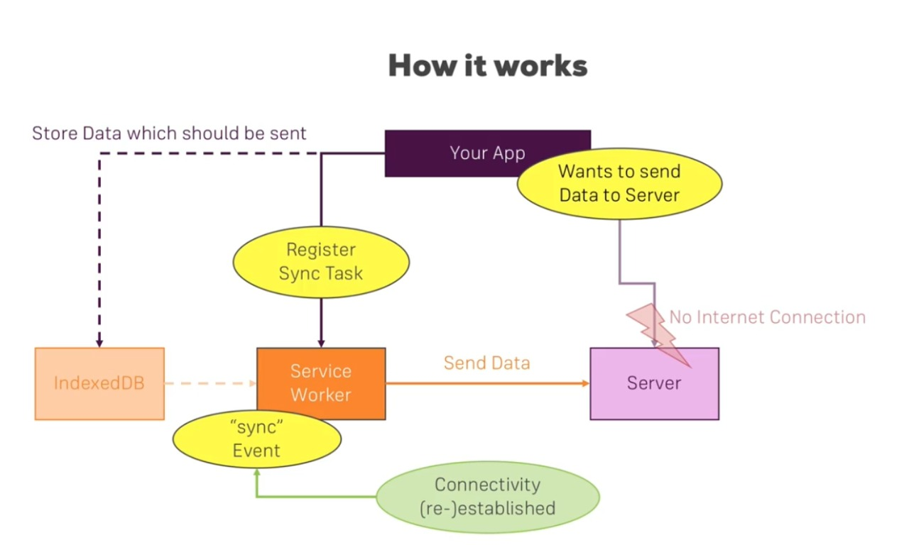

## Background Sync

- Background sync is a new web API that lets you defer actions until the user has stable connectivity. This is useful for ensuring that whatever the user wants to send, is actually sent..
- > 

- We are going to use Firebase Functions for sending and getting data from the Firebase Database.

  - > Register a Sync Task

    ```
      form.addEventListener('submit', function (event) {
        event.preventDefault();

        // Form submit handle

        if (navigator.serviceWorker && window.SyncManager) {
          navigator.serviceWorker.ready.then(function (sw) {
            // Writing data to indexedDB so that we can send the request to server whenever connection reestablished
            writeData('<- Store Name IndexedDB ->', <- New Post ->)
              .then(function () {
                return sw.sync.register('sync-new-post');
              })
              .then(function () {
                // Do some stuffs
              })
              .catch(function (e) {
                // If anything gone wrong in this process try direct send data to server
              });
          });
        } else {
          // Direct send data to server
        };
      });
    ```

  - > Listening to Sync Event

    ```
      self.addEventListener('sync', function (event) {
        if (event.tag === <- Distinct Sync Tag Name ->) {
          event.waitUntil(

            // read data from the indexedDB which should be sent to the server
            readData(<- Store Name IndexedDB ->).then(function (data) {
                ...
                ...
                fetch(<- Server URL ->, {
                  method: ['POST', 'DELETE', 'PUT'],
                  headers: { 'Content-Type': 'application/json', Accept: 'application/json' },
                  body: JSON.stringify(<- Data ->),
                })
                  .then(function (res) {

                    // Do some checks to make sure data saved successfully
                    if (res.ok) {
                      return res.json();
                    }
                    throw new Error('Failed to Save!');
                  })
                  .then(function (data) {
                    // Do some stuffs

                    // Delete that data from indexedDB
                    return clearItemFromStore(<- Store Name ->, <- Distinct Identifier for that data ->);
                  })
                  .catch(function (err) {
                    console.log('Error! While sending data to the Server', err);
                  });
                ...
                ...
            })
          );
        }
      });
    ```

### Helpful Links

- [Background Sync Feature](https://developers.google.com/web/updates/2015/12/background-sync)
- [Firebase Functions](https://firebase.google.com/products/functions)
- [Firebase Admin SDK](https://firebase.google.com/docs/admin/setup)
