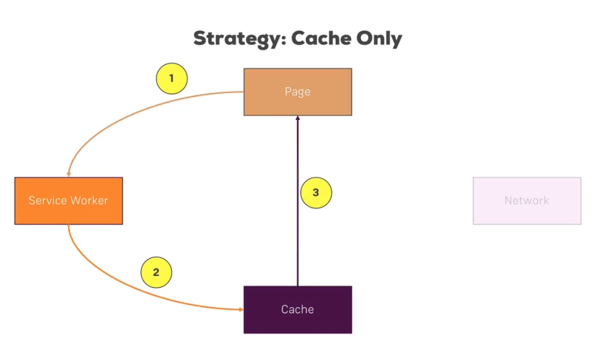
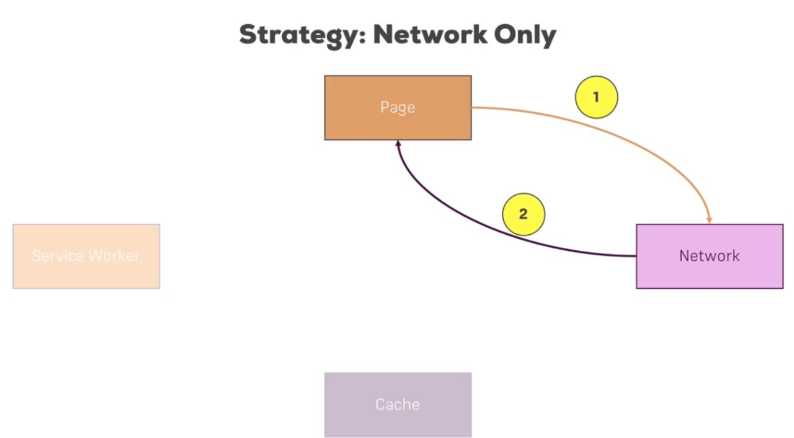
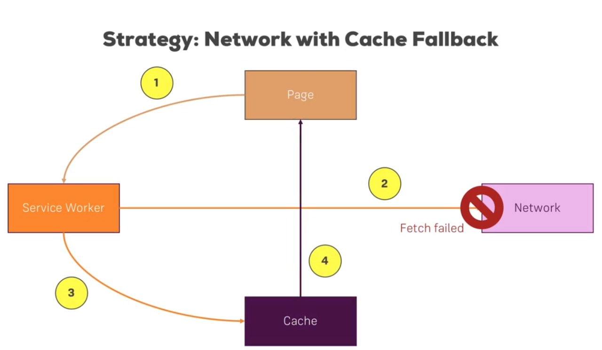
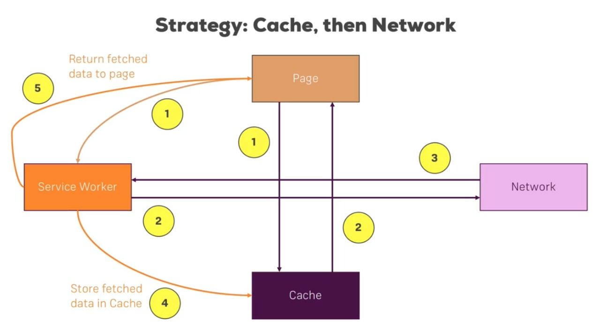

## Service Worker Caching

- Caching is the term for storing reusable responses in order to make subsequent requests faster and also providing some offline Support
- Almost in all websites, we need some Static assets initially eg. css, js file, some fonts, also the html page we are viewing. So we need to cache them in the installation time of the Service Worker.

  > Code for this example

  ```
    self.addEventListener('install', function (event) {
        event.waitUntil(
            caches
                .open(/* Static Cache Storage Name */)
                .then(function (cache) {

                    // Add necessary Static Files
                    cache.addAll([/* Static File List eg. '/index.html', '/style.css', '/app.js' */]);
                })
                .finally(function () {

                    // Skip the waiting
                    self.skipWaiting();
                })
        );
    });
  ```

- By the above strategy only, We never get the up-to-date version of our static files (if do any changes) because Service Worker always return files from the Storage and not update the Cache Storage as well if we don't update the `serviceWorker.js` file. So we need to give some version name to our Static Cache Storage and whenever we update our static files we need to update the version name also.

  > Code for this Example

  ```
    self.addEventListener('activate', function (event) {
        event.waitUntil(
            // Finding all Cache Storage Name
            caches
                .keys()
                .then(function (keyList) {

                    // Iterate through those keys and delete the Cache which are outdated
                    return Promise.all(
                        keyList.map(function (key) {
                            if (![/* Necessary Keys Name we want to keep */].includes(key)) {
                                return caches.delete(key);
                            }
                        })
                    );
                })
                .finally(function () {
                    self.clients.claim();
                })
        );
    });
  ```

### Caching Strategy

- > Cache With Network Fallback

  

  > Code for the Strategy

  ```
    self.addEventListener('fetch', function (event) {
        event.respondWith(

            // First trying to find the resource from cache
            caches.match(event.request).then(function (response) {

                // Response exists in cache storage
                if (response) return response;

                // If not in cache try to load the resource from network
                else {
                    return (

                        // Fetching it from Network
                        fetch(event.request)

                            // Successful Network Response
                            .then(function (res) {
                                return caches.open(/* Dedicated Cache Name */).then(function (cache) {

                                    // Put it on Cache Storage
                                    cache.put(event.request.url, res.clone());
                                    return res;
                                });
                            })

                            // If network fails or the resource not cached yet
                            .catch(function (e) {

                                // returning if not cached and not get fetched from Network
                                return caches.match('/offline.html');
                            })
                    );
                }
            })
        );
    });
  ```

  > Cons

  - We never get any up-to-date data by this strategy if new data available on the Server

- > Cache Only

  

  > Code for this Strategy

  ```
    self.addEventListener('fetch', function (event) {
    	event.respondWith(caches.match(event.request));
    });
  ```

  > Cons:

  - It is not even work when network is available
  - Every request has been broken due to this intercept

- > Network Only

  

  > Code for this Strategy

  ```
  self.addEventListener('fetch', function (event) {
      event.respondWith(fetch(event.request));
  });
  ```

  > Cons

  - It will not work when network is unavailable (Offline)

- > Network With Cache Fallback

  

  > Code for this Strategy

  ```
    self.addEventListener('fetch', function (event) {
        event.respondWith(

            // Trying to get the response from Network
            fetch(event.request)
                .then(function (res) {

                    // Add this response to Cache Storage
                    return caches.open(/* Dedicated Cache Name */).then(function (cache) {
                        cache.put(event.request, res.clone());
                        return res;
                    });
                })

                // If Network Request Fails by any reason (timeout or Offline)
                .catch(function (err) {

                    // return the cached response (if available)
                    return caches.match(event.request).then(function (response) {
                        if (response) return response;

                        // returning if not cached and not get fetched from Network
                        else return caches.match('/offline.html');
                    });
                })
        );
    });
  ```

  > Cons

  - By this Strategy, we have to wait for the network request fail when network not so fast, to get the data from Cache Storage (if data already cached)

- Cache, then Network

  

  > Code for this Strategy (Cover almost all use cases)

  ```
    self.addEventListener('fetch', function (event) {
        // Some Shortlisted URL(s), we want to store up-to-date response to cache Storage

        if (/* Condition that fullfil those shortlisted URL(s) */) {
            event.respondWith(

                // Open the Dedicated Cache Storage
                caches.open(/* Dedicated Cache Name */).then(function (cache) {
                    return fetch(event.request).then(function (res) {

                        // Update the Cache Storage
                        cache.put(event.request, res.clone());
                        return res;
                    });
                })
            );

            // Static Files
        } else if (/* Condition for those resources we want to serve from Cache Storage always (Static Files) */) {
            event.respondWith(caches.match(event.request));

            // All other Resources (But may use some more filters, we don't want to store all request in our cache)
        } else {
            /* Cache With Network Fallback Strategy */

            event.respondWith(

                // First trying to find the resource from cache
                caches.match(event.request).then(function (response) {
                    if (response) return response;

                    // If not in cache try to load the resource from network
                    else {
                        return (
                            fetch(event.request)

                                // Successful Network Response
                                .then(function (res) {
                                    return caches.open(/* Dedicated Cache Name */).then(function (cache) {

                                        // Put it on Cache Storage
                                        cache.put(event.request.url, res.clone());
                                        return res;
                                    });
                                })

                                // If network fails or the resource not cached yet
                                .catch(function (e) {

                                    // If we request a html page to view in Offline mode
                                    if (event.request.headers.get('accept').includes('text/html')) {
                                        return caches.match('/offline.html');
                                    }
                                })
                        );
                    }
                })
            );
        }
    });
  ```

### Some Useful Methods

- Sometimes We may want to unregister our Service Worker from our Websites via Javascript

  > Code for this Example

  ```
    // Some condition when we want to delete the Service Worker
    {
        // Checking Browser supports the Service Worker
        if (navigator.serviceWorker) {

            // Do the unregistration stuffs
            navigator.serviceWorker.getRegistrations().then(function (registrations) {
                for (let i in registrations) registrations[i].unregister();
            });
        }
    }
  ```

- May be some cases we don't want to store too much data to the Browser Storage and want to delete storage after some limits
  > Code for this Example
  ```
    function trimCache(cacheName, maxItems) {
        caches.open(cacheName).then(function (cache) {
            cache.keys().then(function (keyList) {
                if (keyList.length > maxItems) {
                    cache.delete(keyList[0]).then(function () {
                        trimCache(cacheName, maxItems);
                    });
                }
            });
        });
    }
  ```

### Helpful Links

- [Cache API](https://developer.mozilla.org/en-US/docs/Web/API/Cache)
